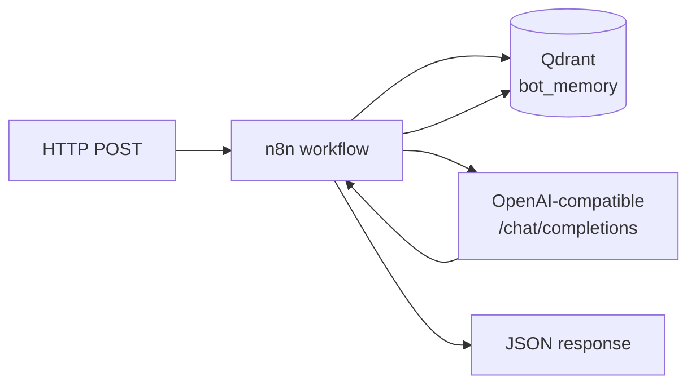

# Sonbot — n8n + Qdrant + LLM (Docker)

Репозиторий на GitHub: **[Switchell/Sonbot](https://github.com/Switchell/Sonbot)** *(ранее `sonbot-n8n-qdrant`, `n8n-qdrant-assistant-demo`, изначально `bot-showcase-n8n-qdrant`)*.

**RU:** локальный стенд «ассистент с памятью» для демо и доработок. **EN:** self‑hosted **n8n** orchestration, **Qdrant** vector memory, OpenAI‑compatible chat, one **`docker compose`** stack.

[](docker-compose.yml)
[](https://n8n.io/)
[](https://qdrant.tech/)
[](LICENSE)

## Что внутри

Цепочка **вебхук → нормализация входа → поиск в Qdrant (`bot_memory`) → LLM с контекстом → запись диалога в Qdrant → JSON‑ответ** (режим *Respond to Webhook* в n8n).



Тело запроса (пример):

```json
{ "user_id": "u1", "message": "Привет" }
```

Экспорт workflow: [`workflows/assistant_chat_llm.workflow.json`](workflows/assistant_chat_llm.workflow.json). Пример вызова: [`samples/webhook_request.json`](samples/webhook_request.json).

## Требования

- Docker Desktop (Windows/macOS/Linux)
- PowerShell (скрипты в `scripts/`)

## Быстрый старт

1. Склонировать репозиторий.
2. Скопировать окружение: скопируйте `.env.example` в `.env`, задайте `N8N_ENCRYPTION_KEY` и `OPENAI_*`.
3. В корне должен быть файл **`google-creds.json`** (сервисный ключ Google для нод n8n) — он смонтирован в `docker-compose.yml`. Для чистого UI‑демо без Google допустима заглушка вроде `{}` в файле; при ошибках монтирования проверьте путь и права.
4. Из каталога **`scripts`**:
   - `.\up.ps1` — поднять стек (`sonbot`: n8n на **http://localhost:5678**, Qdrant на **http://localhost:6333**).
   - `.\health.ps1` — проверка `n8n` и `qdrant`.
5. Импорт workflow в пустую n8n: `.\restore-workflows.ps1` или ручной импорт JSON из `workflows/`.

Перед первым запуском в Qdrant должна существовать коллекция **`bot_memory`** (создаётся вручную в UI Qdrant). Чеклист демо: [`DEMO_CHECKLIST.md`](DEMO_CHECKLIST.md). Дорожная карта бота: [`ROADMAP_BOT.md`](ROADMAP_BOT.md).

## Полезные команды (PowerShell)

| Скрипт | Действие |
|--------|----------|
| `up.ps1` | Запуск compose |
| `down.ps1` | Остановка |
| `status.ps1` | Статус контейнеров |
| `logs.ps1` [сервис] | Логи |
| `restore-workflows.ps1` | Подтянуть workflow из Git в n8n |

Compose project name: **`sonbot`** — отдельные тома; при смене имени проекта данные старых томов сами не подтянутся.

## Структура репозитория

| Путь | Назначение |
|------|------------|
| `docker-compose.yml` | Сервисы `n8n`, `qdrant`, volumes |
| `workflows/` | Экспорт витринных workflow (JSON) |
| `scripts/` | Операции жизненного цикла под Windows |
| `samples/` | Примеры запросов к вебхуку |

## Безопасность

В `.gitignore`: `.env`, `google-creds.json`. Не публикуйте ключи и токены в issue/архивах.

Краткий текст для карточки услуги (Kwork и т.п.): [`KWORK_OFFERING.md`](KWORK_OFFERING.md).

## Описание для GitHub (About)

Скопируйте в поле *Description* репозитория:

`n8n + Qdrant + OpenAI-compatible LLM in Docker — webhook assistant with vector memory (demo workflow included).`

**Topics (теги):** `n8n`, `qdrant`, `docker`, `docker-compose`, `llm`, `vector-database`, `automation`, `webhook`, `openai-api`.

## Лицензия

[MIT](LICENSE).
